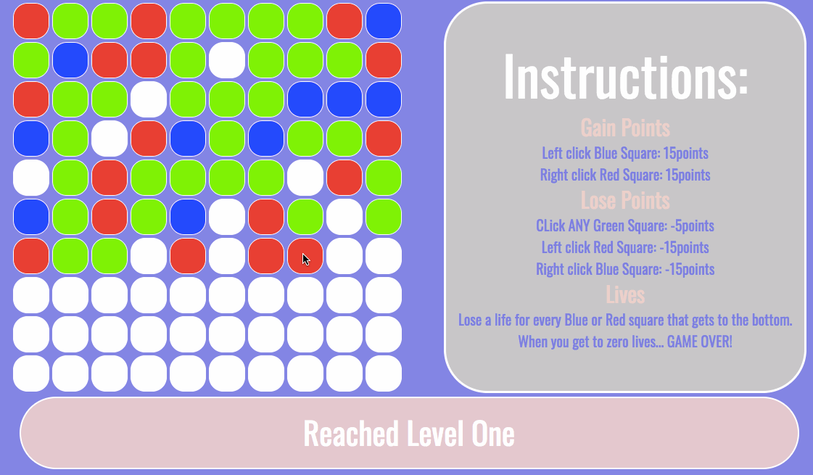

## WDI-Project-One

#### Colour Clicker by Martin Allgood

Project one started with the brief to make a browser based game using HTML, CSS and Javascript (with the help of Jquery). Over the course of a week (Friday afternoon - Thursday evening), we had to build and style a game of our own creation. The idea behind the game was to have the tiles falling through the game grid and the user would interact with them depending on which colour it was.

WEBSITE HERE.

***

**Aim of the game:** Gain as many points as you can by left clicking Blue squares, and right clicking Red squares. lose points by left/right clicking the wrong colour squares, or by clicking green squares at all.

Last as long as you can, once 5 Red/Blue squares make it to the bottom, game over.
There are 8 levels to get through in 90seconds.

---

**What was a win?**
I really enjoyed the challenge of creating something from scratch. Creating the game logic first, then putting features on top of it, and the experience of how the game idea evolved through the coding process with what was possible.

**What was a challenge?**
At the start, trying to make sure that I wasn't hard coding a lot of the early functions so that they could be called on later on in the build process without having to change too much. It took a while to work out the logic to achieve this and I maybe invested a bit too much time in to it and wasn't able to get to some of the more advanced features that I had originally planned that would help players advance further in to the game once the speeds get a lot faster.
In addition, at the start

**What would you do differently?**
If I had the chance to make this game again I would start making the basic game at first and then implement bonus features later once MVP had been reached. Initially I started with bonus tiles in mind and lost time trying to future proof my code with features I ended up not using.

---

### Planned Features

###### Extra Tiles
Initially there was a plan for extra tile types that would have bonus features.
*Purple tiles to clear any red/blue tiles within a certain distance.
Orange tiles that would require an m3 click at later levels of the game.
Gold tiles to clear the bottom 5 rows of red/blue tiles.*

###### Win condition
I would have implemented a game win condition, but at point of completion no one had made it past level 7 in testing. This would have also included bonus points for completion time.

###### Tile odds
Currently there is simply a 1/4 chance of the tile type. Originally I did have the odds slightly different however with the progress of the game, and implementation of level up meaning that I would have to adjust these odds for a level up to increase/decrease the amount of certain tiles.

###### Point and level animations
Animations for scoring points, level up and high score.

###### Mobile/Tablet responsiveness
If I had more time I would have created it to be mobile/tablet friendly, as during some play testing people mentioned that they could see themselves playing the game on their phone on their commute to work.
